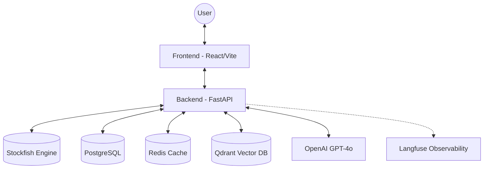

# Architecture: Chess Cognify AI

Chess Cognify AI is a comprehensive chess analysis and coaching platform that combines traditional chess engines (Stockfish) with modern Large Language Models (LLMs) and Retrieval Augmented Generation (RAG).

## 1. System Overview

The application follows a classic client-server architecture with several specialized microservices for data persistence, engine analysis, and vector search.

## 2. Technology Stack

### Core
- **Backend**: FastAPI (Python 3.11) - chosen for its asynchronous performance and Type Hinting support.
- **Frontend**: React 18 with Vite - styled with Tailwind CSS and Radix UI primitives.
- **Chess Logic**: `chessground` (UI), `chessops` (logic), and `python-chess` (backend).

### Engines and AI
- **Stockfish**: Integrated via UCI protocol for position evaluation and move validation.
- **OpenAI**: GPT-4o used for generating natural language explanations of chess moves.
- **LangChain**: Orchestrates the interaction between LLMs, memory, and retrieval.

### Infrastructure
- **PostgreSQL**: Primary relational database for user games, book metadata, and analysis results.
- **Alembic**: Database migration tool.
- **Redis**: Used for caching engine evaluations and LLM responses to reduce latency and API costs.
- **Qdrant**: Vector database for RAG, storing embeddings of chess books.
- **Docker**: Containerization for reproducible development and production environments.

## 3. Core Features

### 3.1 Self-Analysis Board
- **Real-time Eval**: Continuous Stockfish analysis as you make moves on the board.
- **Multi-PV Support**: Configurable number of engine lines (2-10).
- **PGN Support**: Import and export games in Standard Algebraic Notation.
- **Technical Deep-Dive**: See **[Self Analysis Feature Details](self_analysis_feature.md)**.

### 3.2 Automated Game Review
- **Move Classification**: Categorizes moves as Great, Excellent, Good, Inaccuracies, Mistakes, or Blunders.
- **Accuracy Rating**: Calculates a percentage-based accuracy score for each side.
- **Technical Deep-Dive**: See **[Game Review Feature Details](game_review_feature.md)**.

### 3.3 AI Chess Coach (RAG)
- **Book Chat**: Ask questions about specific chess concepts.
- **Context-Aware**: The coach retrieves relevant sections from high-quality chess books.
- **Technical Deep-Dive**: See **[Book Companion Feature Details](book_companion_feature.md)**.

## 4. Data Flow

1.  **Analysis**: UI sends FEN -> API -> Stockfish -> Returns Evaluation -> UI updates.
2.  **Review**: UI uploads PGN -> API -> Sequentially analyzes moves with Stockfish -> Classifies moves via LLM -> Persists to DB -> Returns Summary.
3.  **Chat**: UI sends Message -> API -> Retreives vectors from Qdrant -> Constructs Prompt (Context + Question) -> LLM -> Returns Answer.

## 5. Deployment Orchestration

Managed via **Docker Compose**:
- `frontend`: Nginx serving built React assets.
- `backend`: FastAPI app running on Uvicorn with Stockfish installed.
- `postgres`: Persistent relational storage.
- `redis`: Ephemeral cache.
- `qdrant`: Persistent vector storage.
