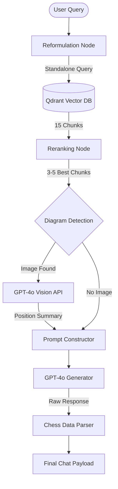

# Feature: AI Chess Coach (RAG & VLM Companion)

The AI Chess Coach is a sophisticated pedagogical system that combines **Retrieval-Augmented Generation (RAG)** with **Vision-Language Models (VLM)**. It allows users to ask questions grounded in classic and modern chess literature.

## 1. Feature Description
- **Literary Grounding**: Every answer is based on actual book passages, not just the AI's internal training data.
- **Visual Intelligence**: The AI "looks" at diagrams and figures within the books using vision models to interpret arrows, highlighted squares, and piece configurations.
- **Context-Aware History**: Remembers the last few messages to handle follow-up questions like "Can you show me another example of that?".
- **Interactive Demonstrations**: Automatically converts move sequences mentioned in texts into playable chess boards in the chat UI.
- **Source Transparency**: Provides the exact page numbers and book titles for every piece of advice given.

## 2. Low-Level Architecture

### The 10-Step LangGraph Pipeline
The coach operates as a directed graph where each node represents a specialized AI function.

1.  **Reformulation**: Converts conversational queries into standalone search terms.
2.  **Vector Retrieval**: Searches **Qdrant** for high-relevance semantic chunks using `bge-m3` or `text-embedding-3` embeddings.
3.  **Chunk Reranking**: A "cross-encoder" style LLM step that trims the 15 retrieved segments down to the most critical 3-5.
4.  **VLM Extraction**: Identifies if a chunk is linked to a book diagram.
5.  **Vision Analysis**: Sends diagram image bits to **GPT-4o Vision** to get a technical description of the position.
6.  **Context Assembly**: Merges textual passages and visual summaries into a single dense prompt.
7.  **Answer Synthesis**: The primary GPT-4o model generates the final teaching response.
8.  **Chess Parsing**: Extracts SAN moves, FENs, and PGNs from the answer into JSON blocks.
9.  **Image Metadata Filtering**: Ensures that images shown in the UI are strictly relevant to the generated answer.
10. **Final Assembly**: Combines answer text, source metadata, and interactive boards into the final response object.

### Architecture Diagram


## 3. Implementation Details

### VLM Strategy (Vision-Enhanced Pedagogy)
The `RagService` maintains a mapping between text chunks and image assets. When a chunk is retrieved, the service performs an asynchronous parallel call for visual analysis:
```python
# Node Step: _node_vlm_summaries
# Parallel execution for up to 3 diagrams per turn
tasks = [self._analyze_single_image(url) for url in image_urls]
summaries = await asyncio.gather(*tasks)
```
The VLM is prompted to: *"Describe this chess diagram. Identify the position, key pieces, and any tactical patterns or arrows shown."*

### Structured Output & Interactive Boards
The generator is instructed to use specialized tags (`CHESS_DATA_JSON_START/END`). These allow the frontend to instantly render a board with:
- **`fen`**: The exact position described.
- **`pgn`**: A sequence of moves the user can play through.
- **`image_url`**: The original book diagram.

## 4. Data Flows

### The RAG Consultation Flow
1.  **Query**: "Explain the minority attack in the Queen's Gambit."
2.  **History**: "User just talked about the Exchange Variation."
3.  **Reformulation**: "Strategic explanation of the minority attack in the Queen's Gambit Exchange Variation."
4.  **Retrieval**: Fetches chunks from *Pawn Structure Chess* by Soltis.
5.  **Vision**: Analyzes a diagram on page 112 showing white's b-pawn advance on b4.
6.  **Answer**: "The minority attack involves... [Text]... CHESS_DATA_JSON_START { ... } CHESS_DATA_JSON_END."
7.  **UI**: User sees the explanation and a board showing the exact pawn formation.

## 5. Comprehensive Example

### Internal Prompt Construction (Context Example)
```text
TEXTUAL CONTENT FROM BOOK:
--- [SOURCE 1] (Page 22) ---
In the endgame, the rook should be placed behind the passed pawn to support its advance.
---

VISUAL DATA FROM BOOK DIAGRAMS:
--- [DIAGRAM 1] ---
IMAGE_URL: /api/book_images/diagram_22.jpg
SUMMARY: An endgame diagram. A white rook on a2, white pawn on a4. Black king is on f7.
---

USER QUESTION: Where should I put my rook in this position?
```

### Final Answer Fragment
> According to Capablanca (source 1, page 22), you should keep your rook behind the pawn. As seen in the diagram from the book, the white rook on **a2** is perfectly placed to support the **a4** pawn's march to promotion. 
> 
> CHESS_DATA_JSON_START
> {
>   "fen": "8/5k2/8/8/P7/8/R7/4K3 w - - 0 1",
>   "description": "Rook behind the passed pawn setup",
>   "image_url": "/api/book_images/diagram_22.jpg"
> }
> CHESS_DATA_JSON_END
