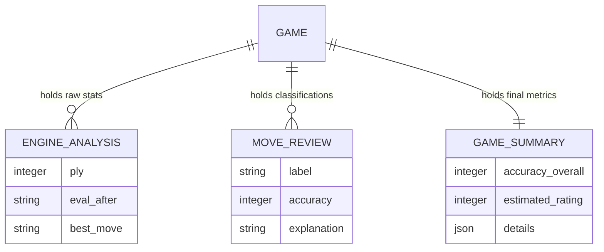

# Feature: Automated Game Review & Classification

The Automated Game Review system is the core "coaching" engine. It takes a complete chess game (PGN) and transforms it into a structured pedagogical report by identifying critical errors and calculating overall performance metrics.

## 1. Feature Description
- **Move-by-Move Labeling**: Every move is categorized using standardized chess terminology (e.g., "Brilliant", "Blunder").
- **Accuracy Scoring**: A 0-100% score for each side, representing how closely their play matched the engine's top choice.
- **Estimated Elo**: A simulated rating based on the complexity and accuracy of the moves.
- **Pattern Recognition**: Detects recurring weaknesses, such as "Struggles with back-rank mates" or "Poor endgame conversion."
- **Visual Summaries**: Provides a high-level table of mistakes, inaccuracies, and blunders for both players.

## 2. Low-Level Architecture

### Multi-Service Orchestration
The review process is orchestrated by `EngineAnalysisService`, which delegates specific logic to specialized sub-services.

1.  **`EngineAnalysisService`**: Manages the high-level loop through the game. It handles "Adaptive Depth" analysis.
2.  **`MoveClassificationService`**: A deterministic logic engine that applies pawn-loss thresholds to categorize move quality.
3.  **`AccuracyRatingService`**: Uses statistical mapping to convert raw centipawn loss into user-friendly percentages and Elo estimates.
4.  **`ThemeAnalysisService`**: Analyzes the tactical nature of mistakes (e.g., pins, forks, discoveries).

### Database Schema Interaction


## 3. Implementation Details

### Adaptive Depth Algorithm
To maximize accuracy while maintaining performance, the engine uses a dual-pass logic:
- **Pass 1 (Standard)**: Analyzes the position at **depth 10**.
- **The Delta Check**: Calculates `abs(current_eval - previous_eval)`. 
- **Pass 2 (Deep)**: If the delta is **> 1.0 pawn (100cp)**, it indicates a critical moment. The engine re-analyzes at **depth 20** to ensure the "Mistake" or "Blunder" label is 100% accurate and not a depth artifact.

### Classification Thresholds
Determined in `MoveClassificationService.py`:
- **Best**: PlayedMove == BestMove.
- **Good**: Centipawn Loss (CPL) <= 50.
- **Inaccuracy**: CPL <= 100.
- **Mistake**: CPL <= 200.
- **Blunder**: CPL > 200.

### Accuracy Formula
We use a sigmoid-style mapping to convert centipawn loss (CPL) into a 0-100 score:
`Accuracy = 100 - (CPL * 1.0)` (simplified version). 
This ensures that small inaccuracies only slightly lower accuracy, while blunders cause significant drops.

## 4. Data Flows

### The Review Job Flow
1.  **Ingestion**: `POST /api/games/upload` receives a PGN. A unique `game_id` is generated.
2.  **Preprocessing**: PGN is parsed using `python-chess`. Total plies are identified.
3.  **Synthesis (The Loop)**:
    - For each ply:
        - `analyze_move()` is called.
        - Stockfish is queried for `eval_before`, `eval_after`, and `best_move`.
        - Results are persisted to the `engine_analysis` table.
4.  **Enrichment**:
    - `MoveReview` records are created by checking deltas against thresholds.
    - LLM Prompt is constructed with the worst moves for a textual summary.
5.  **Finalization**: `GameSummary` is calculated and saved. `Game.status` is set to `completed`.

## 5. Comprehensive Example

### Move Classification Result (Single Move)
- **Ply**: 24 (White)
- **FEN**: `r2qk2r/ppp2ppp/2n5/4p3/2B5/2NP1N2/PPP2PPP/R2QK2R w KQkq - 0 12`
- **Move Played**: `d3d4`
- **Eval After**: `-3.5`
- **Best Move**: `O-O`
- **Eval Best**: `+0.2`
- **Analysis**:
    - **Delta**: `abs(-3.5 - 0.2) = 3.7 pawns`.
    - **Threshold**: 3.7 > 2.0.
    - **Result**: `Blunder`.

### Final Game Summary Data
```json
{
  "accuracy": 82,
  "white_accuracy": 78,
  "black_accuracy": 86,
  "estimated_rating": 1450,
  "move_counts": {
    "white": { "Best": 12, "Good": 4, "Inaccuracy": 2, "Mistake": 1, "Blunder": 2 },
    "black": { "Best": 15, "Good": 3, "Inaccuracy": 1, "Mistake": 0, "Blunder": 0 }
  },
  "weaknesses": [
    "Developing pieces too slowly",
    "Over-extending center pawns",
    "Missing back-rank defensive tactics"
  ]
}
```
